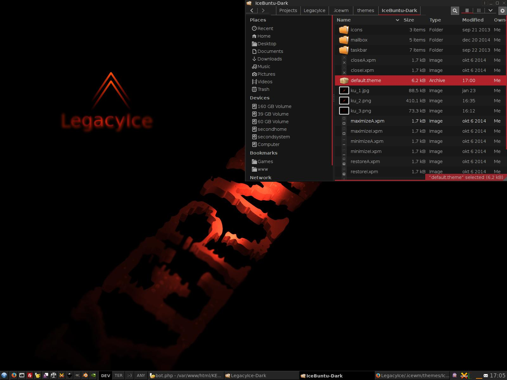

## LegacyIce
Goal of the project is to return the traditional desktop

### Based on
* IceWM
* Ubuntu (current)
* Now based on Gnome3 (no Gnome Shell)

### Aim

#### Repository for last IceWM
* Make latest package of [IceWM](https://github.com/bbidulock/icewm)
* Make latest package of [IceWM Control Panel](http://sourceforge.net/projects/icesoundmanager/) (in the future)

#### Script to convert Ubuntu to LegacyIce
* Remove Unity and Ubuntu specific packages
* Dynamic menu created after install or uninstall package
* Fixed run QT5 applications and other patches
* Nice dark theme for WM
* Hacker GTK2/3 theme - HackStation
* Unification QT theme with GTK
* Set panel (IceWM panel)
* Set applets
* Custom shutdown dialog window - YAD
* Set effect (transparency etc.) Compositor - Compton
* Resolves user permissions for reboot and shutdown
* Custom start script
* Custom shutdown, reboot script
* Menu same as the Gnome2
* Keyboard shortcuts for programs
* Keyboard shorcuts for sound volume, screenshot, etc.
* System status over OSD
* Same behavior of windows
* Workplace settings
* Taskbar applications (Pidgin, Xchat, etc.)
* Removes unnecessary programs, spyware, bloatware, etc.
* Config files for Geany
* Install programs for communication, graphic, multimedia, develop and other
* Nice comments

### Todo:
* [uselessd](http://uselessd.darknedgy.net/)

### Licence:
[GNU GPLv3](http://www.gnu.org/licenses/gpl-3.0.html)

