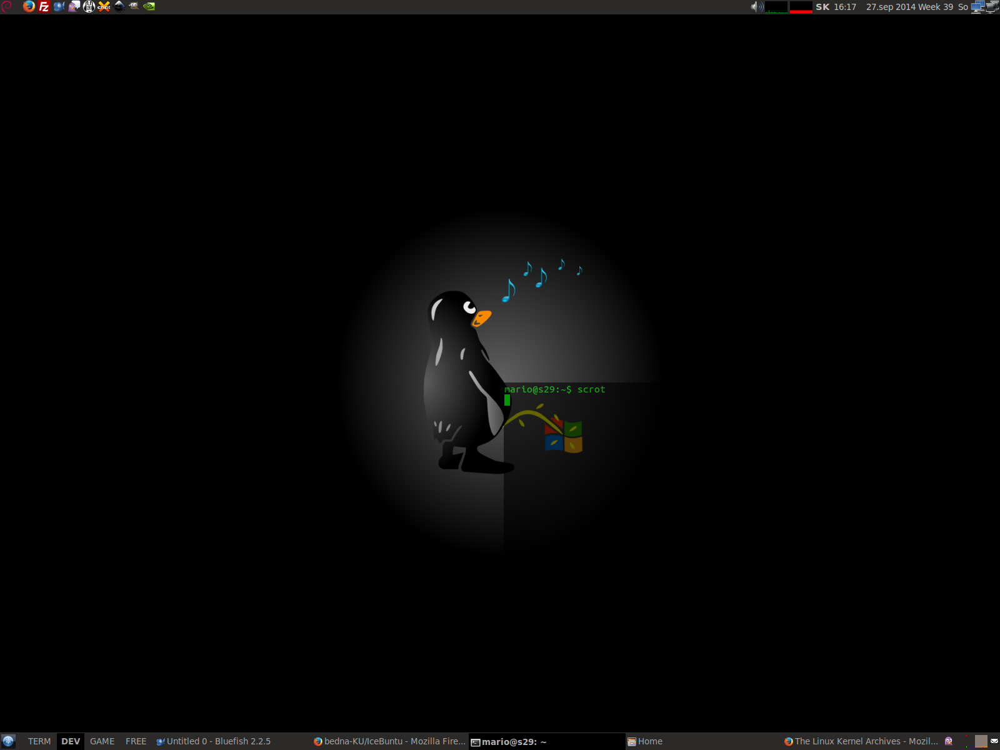

## LegacyIce
Goal of the project is to return the traditional desktop

### Based on
* IceWM
* Ubuntu (as yet)
* Now based on Gnome3 (no Gnome Shell)

### Aim

#### Repository for last IceWM
* Make latest package of [IceWM](https://github.com/bbidulock/icewm)
* Make latest package of [IceWM Control Panel](http://sourceforge.net/projects/icesoundmanager/)

#### Script for convert Ubuntu to IceBuntu
* Remove Unity
* Set IceWM theme dark/lights
* Set efect (opacity etc.)
* Set panels (IceWM panel, LXpanel)
* Set applets
* Set basic programs
* Set scripts
* Install patched IceWM

### Todo:
* [uselessd](http://uselessd.darknedgy.net/)

### Licence:
[GNU GPLv3](http://www.gnu.org/licenses/gpl-3.0.html)

